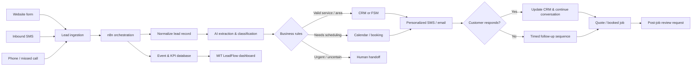
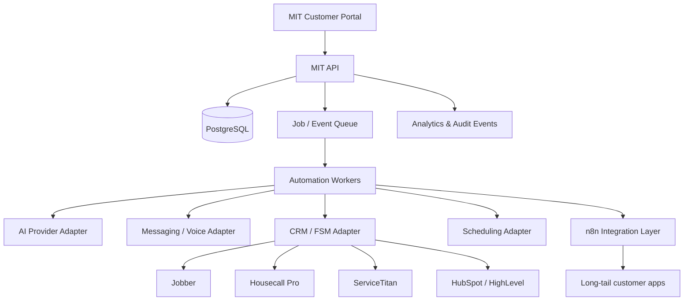
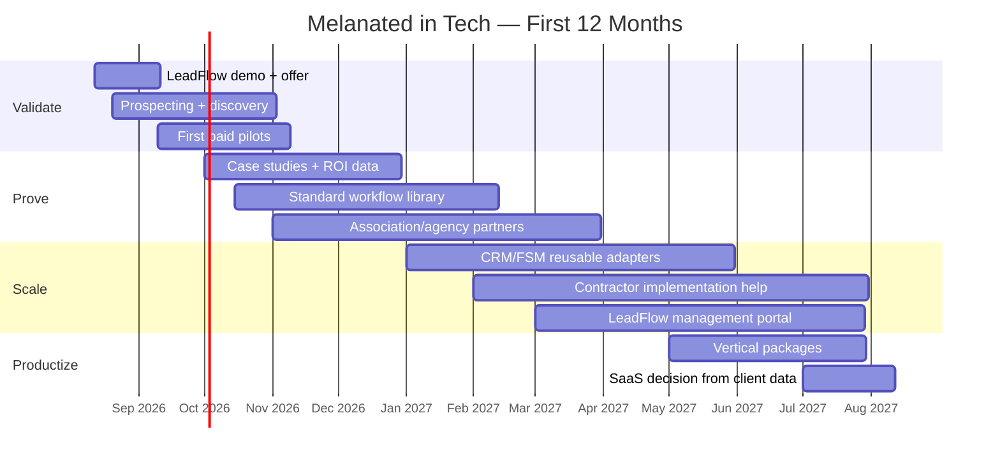

# Melanated in Tech: Building a Revenue-Generating Automation Company for Service Businesses

## Executive summary

**The opportunity is real, but Melanated in Tech should not enter the market as another generic “AI automation agency.”** The stronger position is a **revenue-and-operations automation company for service businesses**, beginning with a narrow commercial wedge: converting more inbound inquiries into booked jobs and preventing leads from dying because of missed calls, slow response, weak follow-up, disconnected systems, or administrative overload.

The underlying market is large. The SBA counted **36.2 million U.S. small businesses in 2026**, employing 62.3 million people. Within home services specifically, Angi estimated a **$657 billion U.S. addressable market and 665.6 million annual projects** in 2022; its latest spending research says the average U.S. homeowner spent **$12,472 on home projects in 2025**, up 3.5% year over year. Those figures are not a precise 2026 TAM for MIT, but they demonstrate that MIT would be selling into a very large existing economic activity base rather than trying to create a new category. citeturn18search0turn18search2turn18search3

AI adoption is meaningful but far from saturated. The nationally representative Census Bureau Business Trends and Outlook Survey found that overall business AI use hovered around **17%–20% from December 2025 through May 2026**, with expected use at 20%–23%. Census also found adoption rising with firm size and remaining below 20% among firms with four or fewer employees. citeturn18search1turn18search5 At the same time, surveys focused on smaller and more digitally engaged businesses report much higher usage: QuickBooks found **68% of more than 2,200 U.S. small businesses surveyed in April 2025 regularly used AI**, while Jobber reported **52% of home-service owners using AI day to day**, and Housecall Pro found **48% of 248 U.S. home-service professionals surveyed in 2026 actively using AI**. These percentages are not directly comparable because definitions, populations, and methodologies differ; together they suggest a market in which AI awareness is widespread but deep workflow integration is not yet universal. citeturn9view0turn9view2turn4view4

That gap matters because the most commercially relevant problems are not “How do I use ChatGPT?” They are operational problems. Jobber reports that **more than 70% of consumers expect same-day responses and more than half expect a response within an hour**, while only about **20% of service businesses respond to leads within an hour**. Customer communication is a top time drain for 40% of surveyed businesses, quoting for 37%, paperwork for 31%, invoicing for 28%, and scheduling for 27%. citeturn3view0turn4view1 Housecall Pro likewise found that among home-service AI users, 40% say it helps them respond faster and lose fewer leads, 52% use it for customer communication, and 51% for estimates or quotes. More than one-quarter report saving at least six administrative hours per week. citeturn4view4

**My primary recommendation is therefore to launch MIT LeadFlow before building a broad automation catalog.**

> **MIT LeadFlow™ — Capture every inquiry. Respond immediately. Follow up consistently. Book more of the leads you already paid to generate.**

LeadFlow should initially automate:

**call / form / text inquiry → lead capture → intent and urgency detection → immediate response → qualification → booking → CRM update → unanswered-lead follow-up → estimate follow-up → post-job review request → performance dashboard**

This puts MIT close to revenue instead of merely selling labor savings.

The competitive analysis also changes the product strategy. Jobber, Housecall Pro, ServiceTitan, Workiz, Podium, Sameday, Hatch, HighLevel and others already automate substantial pieces of the service-business lifecycle. MIT should **not** attempt to replace those systems. The opportunity is to become the **integration and optimization layer around whatever a customer already uses**—especially when the customer has a website, telephone system, field-service CRM, email, scheduling, marketing and review tools that do not behave like one coordinated system. citeturn19search4turn19search5turn19search6turn19search15

The business model should consequently be **productized services first, reusable IP second, software product third**:

| Offer | Recommended launch price | Purpose |
|---|---:|---|
| Automation Opportunity Assessment | **$495** | Diagnose revenue and operational leakage |
| MIT Quick Win | **$1,750–$2,500** | Solve one measurable workflow problem |
| MIT LeadFlow Growth System | **$4,500–$7,500** | Full lead-response/booking/follow-up system |
| MIT Automation Care | **$350–$1,250/month** | Monitoring, support, optimization and reporting |

A realistic founder-led first-year objective is **$75,000–$105,000**, with **$120,000–$140,000 as a stretch target** if delivery becomes standardized and implementation assistance is added during the second half of the year. These are management targets, not market forecasts.

The first 90 days should **not** be spent building ten products or completely rebuilding melanatedintech.com. The highest-value sequence is:

**one ICP → one LeadFlow demo → one landing page → 300–400 carefully selected prospects → discovery calls → 2–3 paid pilots → measured case study → partnerships → repeat.**

And one strategic change is especially important given MIT's existing website. The current site presents Melanated in Tech primarily as a home for AI agents, with an agent marketplace, knowledge hub, tools and products. That work should not be discarded. It should become the **authority and product library behind the commercial offer**, while the public front door shifts toward measurable business outcomes. citeturn10search1turn10search0

**Bottom line:** do not bet MIT on people wanting “AI.” Bet it on businesses already losing money and time through broken follow-up, disconnected systems and repetitive work.

## Market, customer economics, and the problems worth solving

### The market is large enough; the harder question is where to enter

MIT does not need a massive share of the national SMB market. It needs a small number of businesses with enough inbound opportunity volume and customer value that automation can pay for itself.

The U.S. has more than **36 million small businesses**, but that number is far too broad to serve as a practical target market. citeturn18search0 A more relevant directional indicator is Angi's home-services research. Its 2022 estimate put U.S. home services at **$657 billion**, divided among $475 billion of improvement, $105.9 billion of maintenance and $76.4 billion of emergency repair, covering 665.6 million projects annually. citeturn18search3 Angi's more recent research found average homeowner project spending of $12,472 in 2025. citeturn18search2

The initial market should therefore be treated as an **account-based serviceable market**, not an abstract billion-dollar TAM.

An excellent MIT prospect would have most of the following characteristics:

| Qualification signal | Why MIT should care |
|---|---|
| 30+ inbound inquiries per month | Enough volume for response improvements to matter |
| Calls/forms arrive after hours | Creates obvious lead leakage |
| Average job value is material | One or two additional jobs can fund automation |
| Owner/admin manually follows up | Clear labor and consistency problem |
| Existing website and phone presence | No need to rebuild demand generation first |
| Existing CRM/FSM, even if poorly used | MIT can enhance rather than replace systems |
| Quotes regularly go unanswered | Direct follow-up opportunity |
| Reviews materially influence selection | Post-job automation has economic relevance |
| Owner can approve a $2K–$8K project | Avoid enterprise procurement early |

That leads to a more useful industry prioritization:

| Priority | Verticals | Best initial MIT problem |
|---|---|---|
| **Highest** | HVAC, plumbing, restoration | Missed/after-hours calls, urgency, immediate booking |
| **High** | Roofing, remodeling, general contractors | Estimate/quote follow-up and lead nurturing |
| **High** | Cleaning | Booking, recurring-service reactivation, reviews |
| **High** | Landscaping/lawn care | Quote follow-up, repeat visits, seasonal reactivation |
| **Channel opportunity** | Marketing/web/SEO agencies | White-label/referral LeadFlow for their clients |

Jobber's 2026 data reinforces putting HVAC, plumbing and roofing near the top. It reports AI usage of roughly **81.5% among HVAC businesses, 67% among roofers and 65% among plumbing businesses** in its industry spotlights; it also reports that more than 60% of HVAC respondents and more than half of roofing respondents exceed $500,000 in revenue. citeturn9view2 Those are Jobber-survey figures rather than Census estimates, but they indicate comparatively strong willingness to invest in technology among parts of the trades.

Cleaning and landscaping remain attractive, but the LeadFlow pitch can shift from “capture an emergency $1,000+ job” toward **recurring revenue, reactivation, route filling and reputation**.

Agencies deserve different treatment. Instead of competing for agencies as the primary end customer, MIT should eventually make agencies a **distribution channel**. A web designer, SEO consultant or digital ad agency generates demand but can lose credibility when its customer's leads are ignored. MIT can become the “what happens after the lead arrives” partner.

### AI adoption creates an unusually good timing window

The adoption numbers look contradictory until the survey methodologies are separated.

Census' nationally representative employer-business data found 17%–20% of firms using AI in any business function between December 2025 and May 2026. Its 2026 AI supplement separately measured 18% firm-level use, rising to 32% when employment-weighted; 57% of AI-using firms were still using AI in three or fewer business functions. citeturn18search1turn18search8

QuickBooks' smaller-business survey found 68% regular AI use, including 43% for marketing, 36% for customer service, 33% for administrative tasks, 32% for data processing and 29% for bookkeeping. Among AI users, 74% reported higher productivity and 41% said AI had increased revenue. citeturn9view0

Jobber reports 52% daily AI use among home-service owners, with quoting at 54%, invoicing at 52%, writing at 51%, customer communication/follow-up at 35%, and scheduling/dispatch at 29%. citeturn9view2 Housecall Pro's 2026 trades survey found 48% active AI use and another meaningful segment planning to experiment. citeturn4view4

The strategic interpretation is not “68% of every small business uses AI.” That would overstate the evidence.

It is:

> **The market no longer needs to be convinced that AI exists, but many smaller businesses still have not turned AI into reliable, connected business processes.**

That is precisely where an implementation company has room.

### The pain-point hierarchy

The research supports a clear priority order.

**Lead response is first.** Jobber found 28% of consumers expect an immediate response and another 28% expect one within an hour, yet only 20% of service businesses report responding within an hour. Speed is also a deciding factor for roughly one-quarter of customers. citeturn9view2turn3view0

**Missed calls are second.** Housecall Pro describes a customer example in which only about 15%–20% of callers previously left voicemail; after AI answering was introduced, roughly 60%–70% interacted with the system and provided information. That is one vendor case, not a universal benchmark, but it illustrates how much opportunity can disappear at voicemail. citeturn4view4

**Quoting and follow-up are third.** Jobber reports that 69% of service businesses say they win more than half of the work they quote, but quoting itself remains a major time burden for 37% of respondents. AI is already frequently being used to create or accelerate quotes. citeturn3view0turn4view1turn9view2

**Administrative work is fourth.** More than one-quarter of Housecall Pro's AI users reported saving at least six administrative hours per week. citeturn4view4

**Scheduling, invoicing and payment follow-up are fifth.** Jobber lists scheduling as a major time drain for 27% and invoicing for 28%. It also reports that businesses offering online payment get paid roughly four times faster than businesses that do not. citeturn4view1

**Reputation automation is sixth, but still important.** Jobber reports reviews as a purchasing factor for 51% of consumers, while Housecall Pro's homeowner research found 73% would refer a company after an excellent experience and 68% would reuse it. citeturn9view2turn4view3

### What ROI can actually look like

The following examples are **illustrative unit-economic models, not promised results**. Their purpose is to teach MIT how to sell using the customer's numbers instead of unsupported “AI will grow your revenue” claims.

| Automation | Illustrative customer assumptions | Economic effect |
|---|---|---:|
| Faster lead response | 100 leads/mo; $1,200 avg job; conversion improves only 5 percentage points | 5 additional jobs = **$6,000/mo gross revenue** |
| Missed-call recovery | 40 missed/after-hours calls; capture rises from 20% to 50%; 35% of newly captured leads book; $900 avg job | ≈4.2 additional jobs = **$3,780/mo gross revenue** |
| Estimate follow-up | 40 quotes/mo; $2,500 avg job; close rate improves 3 points | 1.2 additional jobs = **$3,000/mo gross revenue** |
| Admin automation | 6 hours/week redeployed at $30 fully loaded hourly value | **$9,360/year of capacity** |
| Faster payments | $40K monthly billings; illustrative payment window drops 12 → 3 days | ≈**$12,000 less working capital tied in receivables** |
| Review/reputation | $1,200 avg job, 40% contribution margin | One extra job provides **$480 contribution**, enough to cover a typical $350 care fee |

The six-hours-per-week example is anchored to Housecall Pro's survey result; the payment example is consistent with Jobber's finding that online-payment businesses receive funds substantially faster, but the exact 12-to-3-day assumption is illustrative. citeturn4view4turn4view1

Consider the first LeadFlow scenario more rigorously. Five additional $1,200 jobs per month create $72,000 of annual gross revenue. At an illustrative 40% contribution margin, that is $28,800 of additional contribution. If the implementation costs $5,000 and care is $600 per month, year-one automation spend is $12,200. That leaves $16,600 of incremental contribution after automation expense, equivalent to roughly **136% return on the automation spend under those assumptions**.

That is the sales conversation MIT wants:

> “Let's plug in your actual lead count, close rate, average job value and contribution margin. Then we'll know how many additional bookings this system has to create to pay for itself.”

Not:

> “AI is the future.”

## Competitive landscape and MIT's strategic position

The market is already crowded. That is good and bad.

It is bad because MIT cannot win merely by saying it automates leads, phone calls or follow-ups.

It is good because competitors have already educated service businesses to purchase software for scheduling, CRM, AI reception, reputation, payments and workflow automation.

### Competitive comparison

Prices below are public prices found on official vendor sources as of August 2026 where available. Promotional prices and usage charges can change.

| Competitor | Category / positioning | Current public pricing | Strength | Gap MIT can exploit |
|---|---|---:|---|---|
| **Jobber** | All-in-one field service platform | From **$29/mo annual**; broader tiers rise substantially with users/features citeturn19search0 | Strong quote-to-payment workflow, SMB-friendly | MIT can enhance a customer's existing Jobber setup rather than require migration |
| **Housecall Pro** | Home-service operating platform + AI | Basic **$79/mo or $59/mo annual**; Essentials $189/$149; MAX $329/$299 citeturn19search21 | Deep home-services orientation, built-in AI crew citeturn19search5 | Platform-centric; MIT can coordinate systems beyond HCP |
| **ServiceTitan** | Trades operating system | **Custom, per technician** citeturn19search2 | Extremely deep scheduling, dispatch, call booking, invoicing, reporting | Different implementation/buying motion; MIT can serve smaller operators and optimize integrations |
| **Workiz** | AI-enabled field-service platform | Standard listed around **$55/mo annual**; higher/user pricing varies citeturn19search3 | Integrated calls, AI, scheduling, billing; claims 120K+ pros citeturn19search15 | Customers still need process design and cross-system integration |
| **Sameday AI** | AI phone answering for trades | **$449/mo Launch; $789/mo Scale** citeturn20search24 | Very focused AI reception and ServiceTitan-style booking | Primarily phone/front-desk wedge rather than full revenue/ops lifecycle |
| **Hatch** | AI CSR / omnichannel engagement for service companies | **Custom platform + usage**, annual/per-location model citeturn12view0 | Strong calls/text/email engagement and CRM integration | More sales-led and specialized; MIT can serve smaller custom workflows |
| **Podium** | Messaging, leads, reviews and AI Employee | **Custom quote** citeturn7search6 | Mature local-business communications/reputation platform | MIT can be vendor-neutral and extend into operational/back-office automation |
| **Broadly** | AI receptionist + reputation/local marketing | **Custom quote** citeturn11search30 | Integrated reputation, web presence and communication | Marketing/reputation-centered rather than bespoke operations |
| **NiceJob** | Review/referral/repeat-business automation | Reviews about **$75/mo**, Pro around **$125/mo**, broader web bundle higher citeturn12view2 | Simple, focused reputation workflow | Narrow use case; MIT can include review automation inside a larger lifecycle |
| **Smith.ai** | Human/hybrid virtual front desk | Human virtual receptionist: **$300/mo for 30 calls; $810 for 90; $2,100 for 300** citeturn12view3 | Human interaction and 24/7 intake | Per-call economics and less end-to-end workflow automation |
| **HighLevel** | CRM/automation/white-label platform for agencies | **$97 / $297 / $497 per month** citeturn20search1turn20search5 | Strong agency infrastructure, workflows, SaaS mode and rebilling | Tool complexity; many businesses still need someone to architect and operate it |
| **Zapier** | Horizontal no-code automation | Professional about **$19.99/mo**, Team around **$69/mo** citeturn8search1 | Huge integration ecosystem and simple DIY automation | Customer must design, troubleshoot and maintain workflows themselves |
| **Make** | Visual workflow automation | Core about **$12**, Pro **$21**, Teams **$38/mo** at common credit tier citeturn8search2 | Flexible and economical | Still a builder tool, not a managed business outcome |
| **n8n** | Developer-oriented workflow automation | Cloud Starter roughly **€20/mo**, Pro **€50/mo annual** citeturn8search0 | Flexible, extensible, self-hostable; queue mode can scale with workers citeturn16search0turn16search2 | Requires technical implementation and operational ownership |

This table reveals the most important strategic conclusion in the entire report:

> **Do not build another Jobber. Do not build another Housecall Pro. Do not build another HighLevel.**

MIT's initial competitive advantage should be:

**“We make the systems you already pay for work together around the way your business actually operates.”**

That creates five differentiators.

**Vendor-neutral.** A plumbing company might have WordPress, Google Ads, CallRail, Housecall Pro, Gmail, QuickBooks and a spreadsheet somebody refuses to stop using. MIT does not have to win a platform replacement fight.

**Implementation included.** Zapier and n8n sell capabilities. MIT sells a working outcome.

**Revenue measurement included.** Every installation gets a baseline and before/after dashboard: response time, leads captured, bookings, estimate follow-ups, conversion and hours saved.

**Human handoff included.** MIT does not pretend AI should make every decision.

**Local/accessible service included.** Many SMBs would rather have somebody fix the machine than become workflow engineers.

That is a meaningful position even as vertical software vendors add more AI.

### What the existing MIT website should become

The current Melanated in Tech site emphasizes being **“The home for AI agents”**, with a marketplace, Knowledge Hub, tools and digital products. citeturn10search1 Some current agent products are standalone assistants rather than preconnected operational systems, meaning customers still need external-system setup to turn them into full business automations. citeturn10search0

Do not destroy that ecosystem.

Reorganize it:

**MIT Systems** → done-for-you revenue and operations automation  
**MIT Knowledge** → authority/SEO/education  
**MIT Automation Library** → templates and self-serve products  
**MIT Labs** → future productized software/agents

The commercial homepage should become problem-first:

> **Stop losing leads to slow follow-up.**
>
> Melanated in Tech builds automated revenue and operations systems for service businesses.
>
> **[Get a Lead Leakage Assessment]**

The agent marketplace can remain deeper in the site.

## Technology architecture and the MIT LeadFlow demonstration

### Recommended technology strategy

There should be **two implementation stacks**, not one universal religion.

| Situation | Recommended stack | Why |
|---|---|---|
| Local/home-service MVP | **n8n + Twilio + OpenAI API + Postgres/Supabase + customer's CRM/FSM + native calendar/scheduler** | Vendor-neutral, fast to build, API/webhook-friendly |
| Microsoft-centric client | **Power Automate + Dataverse/SharePoint + Outlook/Teams + Azure/OpenAI or OpenAI API** | Excellent fit when the customer's identity/data/workflows already live in M365 |
| MIT product at scale | **Custom TypeScript/API layer + Postgres + job queue + provider adapters + Twilio + AI API; n8n retained for long-tail integrations** | Separates core multi-tenant business state from customer-specific workflow plumbing |

Microsoft remains a strong tool in your personal arsenal. Power Automate Premium is currently **$15/user/month** and provides premium connectors, cloud and desktop automation capabilities; Microsoft also offers automation-centric Process licensing. citeturn15search0turn15search3

But Power Automate should not become MIT's identity.

A plumber does not need:

> “Power Platform consulting.”

They need:

> “Your missed calls get captured and booked.”

For the home-services MVP, **n8n is probably the best orchestration layer**. Its webhook node can accept events from external applications, and n8n's official architecture supports queue-mode workers when execution volume eventually requires scaling. citeturn16search1turn16search0

Twilio provides the telephone and SMS event layer. Its voice and messaging products can send real-time webhook requests when calls or messages arrive, making them natural front doors into LeadFlow. citeturn15search1turn15search11

OpenAI can provide bounded intelligence such as intent classification, information extraction, message personalization and summarization. For business/API users, OpenAI states that API inputs and outputs are **not used for model training by default unless the organization opts in**. citeturn17search5turn17search8

The crucial architectural principle is:

> **AI interprets; deterministic rules control business-critical actions.**

Do not allow a model to freely decide prices, warranties, service areas, emergencies or financial commitments.

### MIT LeadFlow architecture

The core lead object should remain deliberately simple:

`lead_id`  
`tenant_id`  
`source`  
`name`  
`phone`  
`email`  
`service_requested`  
`urgency`  
`service_location`  
`preferred_time`  
`status`  
`assigned_to`  
`crm_id`  
`last_contact_at`  
`next_followup_at`  
`consent_status`  
`automation_status`

Every event should also be logged separately so MIT can answer:

**When did the lead arrive?**  
**When was the first response?**  
**Did the customer respond?**  
**Was an appointment booked?**  
**Was a quote issued?**  
**Was the quote accepted?**  
**Which automation touched it?**  
**Was a human required?**

That event history becomes the beginning of MIT's real intellectual property: **outcome data**.

### What the minimal demo actually needs

Do **not** build production SaaS before selling this.

The demo needs only:

| Component | Minimum implementation |
|---|---|
| Fake company | “Metro Comfort Heating & Air” or similar |
| Landing page | Name, phone, ZIP, problem, preferred time |
| Phone/SMS | One Twilio number |
| Workflow | One n8n flow |
| AI | Extract service, urgency, location, requested timing |
| Business rules | Service-area check, emergency flag, human escalation |
| CRM | Demo database or free CRM |
| Scheduling | Calendar with 3–5 available slots |
| Outbound | SMS + email confirmation |
| Follow-up | 2 timed reminders with stop-on-response |
| Dashboard | Leads, response time, booked/not booked, source |
| Demo dataset | 10–20 fabricated leads showing different outcomes |

Build the workflow around one realistic input:

> “Hey, our AC quit blowing cold and it's 88 in the house. We're in 28216. Is there any chance somebody can come this afternoon?”

LeadFlow should extract the need, recognize urgency, check service area, immediately acknowledge the request, present appropriate available windows, create/update the record and alert staff.

### The two-minute demo video

| Time | Screen / narration |
|---|---|
| **0:00–0:12** | “A homeowner needs HVAC help at 7:14 PM. Nobody is in the office.” |
| **0:12–0:28** | Customer submits the inquiry or calls the demo number |
| **0:28–0:45** | LeadFlow detects HVAC/no-cooling, ZIP and urgency |
| **0:45–1:05** | Customer receives personalized response and booking choices |
| **1:05–1:20** | CRM record appears automatically with structured details |
| **1:20–1:35** | Owner receives notification; customer books |
| **1:35–1:48** | Show no-response path automatically following up |
| **1:48–2:00** | Dashboard: “Lead received → response 18 sec → appointment booked” followed by CTA |

The closing copy should not be:

> “Built with n8n, Twilio and GPT.”

It should be:

> **How many leads does your business lose because nobody responds fast enough?**
>
> **MIT LeadFlow turns inquiries into trackable follow-up automatically.**

Technology can appear underneath for buyers who care.

### How to evolve from service to product

The scalable architecture should eventually separate customer-specific workflows from MIT's core application.

The sequence matters:

**client work → standardized workflows → reusable adapters → internal portal → multi-tenant product**

not:

**build SaaS → pray contractors buy it.**

## Offers, pricing, and the customer-acquisition engine

### Productized offers

MIT should make purchasing unusually easy.

| Offer | Price | Deliverables | Time box | Commercial objective |
|---|---:|---|---|---|
| **Automation Opportunity Assessment** | **$495** | 60–90 min discovery; workflow map; lead/revenue leak analysis; three automation opportunities; ROI model; implementation recommendation | 3–5 business days | Turn vague interest into a quantified problem |
| **MIT Quick Win** | **$1,750–$2,500** | One workflow; up to ~2 major integrations; notifications; basic logging; documentation; staff walkthrough; 14-day hypercare | 1–2 weeks | Low-risk first purchase |
| **MIT LeadFlow Growth** | **$4,500–$7,500** | Multi-channel intake; qualification; CRM sync; scheduling; 2–3 follow-up workflows; human escalation; KPI dashboard; training; 30-day hypercare | 2–4 weeks | Flagship revenue product |
| **MIT Automation Care** | **$350–$1,250/mo** | Monitoring; break/fix; credential/API maintenance; workflow tuning; reporting; support; periodic optimization | Recurring | Retention + recurring revenue |

Third-party usage—telephony, SMS, model usage, premium CRM/API charges—should generally be billed directly to the customer or transparently passed through rather than hidden inside unlimited pricing.

The $495 assessment should be **credited toward a Growth implementation if purchased within 30 days**. That prevents the assessment from becoming free consulting while reducing buyer resistance.

Do not begin with “free consultations” where you spend an hour designing the entire system.

Offer a **15-minute fit call** for free.

Sell the actual analysis.

### The first 90 days

The acquisition system should combine outbound, public proof, search and partnerships. SEO alone is too slow to validate the offer; cold outreach alone creates no compounding inbound asset.

| Period | Work | Internal KPI target |
|---|---|---|
| **Days 1–14** | Pick HVAC/plumbing as initial messaging wedge; finish LeadFlow demo; publish one landing page; build first prospect list | Demo complete; 150 qualified accounts; 1 sales page |
| **Days 15–45** | Personalized email + targeted calling + LinkedIn; release demo content | 300–400 accounts contacted cumulatively; >5% positive-response target; 6–12 discoveries |
| **Days 46–75** | Close and implement paid pilots; measure baselines and outcomes | 2–3 paid clients; first measurable case study |
| **Days 76–90** | Publish case study; referral outreach; association/agency partnerships; refine offer | 3–5 total paying clients; 2 care agreements; $8K–$15K cash collected |

Those conversion percentages are **operating targets for MIT, not industry benchmarks**. Their purpose is to expose whether the message is working.

### Cold email

**Subject:** quick question about leads at {{Company}}

> {{First name}} — quick question.
>
> When somebody contacts {{Company}} after hours or submits a quote request while your team is busy, how quickly do they usually hear back?
>
> I build a system for service businesses that captures the inquiry, responds immediately, collects the job details, books when appropriate, and keeps following up until the customer replies.
>
> I'm not selling leads or ads—you keep your existing website, phone system and CRM.
>
> I put together a 90-second example of what this looks like for an HVAC/plumbing company.
>
> Worth sending over?
>
> — Antonio  
> Melanated in Tech

The CTA is deliberately **“Worth sending?”**, not “Can I get 45 minutes on your calendar?”

### Cold-call opener

> “Hey, {{Name}}, Antonio with Melanated in Tech. I'll be brief. I'm not calling about advertising. I'm researching how local service companies handle leads when the office is busy. When someone calls after hours or submits a quote form, what normally happens in the first five minutes?”

Then listen.

If the answer exposes a problem:

> “That's exactly the workflow I'm working on. It replies immediately, captures what they need, can offer a booking window, writes it into your system, and follows up if they disappear. I can show you the whole thing in about two minutes.”

That conversation is qualitatively different from:

> “Would you be interested in AI automation?”

### Agency/referral partner message

> “You already help service businesses generate demand. I handle what happens after the lead comes in.
>
> MIT LeadFlow can capture, qualify, book and follow up with leads from the websites and campaigns your team builds—without you having to become an automation support company.
>
> I'm looking for a small number of agency partners for referral or white-label implementations. Could I show you the workflow?”

Possible partners include:

**SEO/web agencies →** their leads need follow-up  
**MSPs/IT companies →** clients ask them automation questions  
**bookkeepers/accountants →** trusted business advisors  
**CRM implementers →** automation extension  
**commercial insurance agents →** large local-business networks  
**chambers/trade associations →** educational access rather than one-to-one prospecting

Trade associations provide unusually concentrated channels. PHCC says it serves approximately 3,500 plumbing/HVAC businesses and has **39 state chapters and 127 local chapters**. citeturn13search9turn13search13 ACCA runs education and contractor events for the HVACR community. citeturn13search0 NRCA describes itself as a leading roofing trade association and has more than 3,600 professional members. citeturn13search6turn13search14 The National Association of Landscape Professionals explicitly emphasizes events, networking and business education. citeturn13search3

Do not begin by asking national organizations for a huge sponsorship.

Start local:

> **Free 25-minute member workshop: “The Five Places Home-Service Companies Lose Leads After They Pay to Generate Them.”**

Teach first. Demo LeadFlow last.

### Content that can actually generate buyers

You do not need to become a generic AI influencer.

Every piece of content should orbit a business problem.

**Short-form / LinkedIn / TikTok / Shorts**

“Watch what happens when an HVAC lead comes in at 9:47 PM.”

“This $10 website form is probably costing contractors thousands.”

“I built a system that follows up with every unaccepted estimate.”

“Your CRM isn't the problem. What happens between your systems is.”

“What happens to a missed call at your business?”

“Three things I would automate in a 10-person plumbing company.”

“Why I would automate this before building an AI chatbot.”

**Long-form YouTube**

“Building an AI Lead Follow-Up System for an HVAC Company From Scratch”

“I Audited a Contractor's Lead Process—Here Are the Five Leaks”

“Jobber vs Housecall Pro vs Automation: What Each One Actually Solves”

“How to Calculate Whether AI Automation Will Make Your Business Money”

“What Happens to a Lead Between Google Ads and a Booked Job?”

The content itself becomes proof of engineering ability. You are no longer asking people to believe you can build software; they can watch the workflow operate.

### SEO pages to build first

Instead of pursuing “AI automation agency,” create high-intent problem pages:

`/hvac-lead-follow-up-automation`  
`/plumber-missed-call-automation`  
`/roofing-estimate-follow-up`  
`/contractor-appointment-booking-automation`  
`/cleaning-business-customer-reactivation`  
`/landscaping-quote-follow-up`  
`/restoration-emergency-lead-routing`  
`/service-business-review-automation`

Each page should contain:

**problem → what happens now → workflow diagram → two-minute demo → ROI calculator → FAQs → assessment CTA**

The Knowledge Hub can then support those money pages with educational articles.

## Risks, roadmap, and prioritized decisions

### Risks that could derail MIT

| Risk | Why it matters | Mitigation |
|---|---|---|
| **Existing platforms add the same AI features** | Jobber, HCP, Workiz and others are already doing this | Sell implementation, cross-platform integration and measurable optimization—not a single feature |
| **No one buys despite technically good demos** | Your historical frustration has been customer acquisition, not ability to build | Validate every product through outreach before expanding it |
| **Scope creep** | “Can you automate one more thing?” destroys margins | Fixed deliverables, change orders, integration limits |
| **Support overload** | One founder cannot monitor dozens of bespoke workflows | Standard components, monitoring, Care agreement, reusable adapters |
| **Platform/API changes** | Third-party services evolve | Provider adapters, health checks, versioned workflows, contingency paths |
| **AI makes incorrect decisions** | Wrong pricing/scheduling/urgency can harm customers | Rules around AI, structured allowed actions, confidence thresholds, human escalation |
| **Poor attribution** | Client may not believe system creates value | Capture baseline and event-level KPIs before launch |
| **Telemarketing/compliance** | Automated SMS/voice can create legal exposure | Begin inbound/consent-based; implement opt-out and consent records; obtain legal review for outbound campaigns |
| **Review gating** | Selectively requesting positive reviews can violate platform policy | Send neutral requests consistently; never suppress unhappy customers |
| **Enterprise procurement** | Security/procurement delays cash flow | Focus owner-led SMBs first |

Communications compliance needs to be designed into LeadFlow rather than patched in later. The FCC has explicitly confirmed that AI-generated voices fall within TCPA restrictions on “artificial or prerecorded voice.” citeturn14search0turn14search4 That makes **unsolicited AI outbound calling a poor first product for MIT**. Begin with inbound calls, customer-initiated inquiries and properly consented follow-up.

For U.S. application-to-person SMS over 10-digit long-code numbers, Twilio states that businesses must complete **A2P 10DLC registration**. citeturn14search2 Commercial-email prospecting must comply with CAN-SPAM requirements, including truthful headers/subject lines and opt-out handling. citeturn14search1turn14search21

Google's policies prohibit fake engagement, which makes automated review generation another area where MIT should build a neutral, policy-compliant workflow rather than selectively steering only happy customers to public reviews. citeturn14search3

These points are a product-design baseline, not legal advice; clients with large outbound programs should have their compliance processes reviewed by qualified counsel.

### The twelve-month roadmap

A disciplined milestone and revenue model would look like this:

| Period | Commercial milestone | Cumulative target |
|---|---|---:|
| **Months 1–3** | Demo, 3–5 paying customers, first case study, 2 care clients | **$8K–$15K** |
| **Months 4–6** | 7–10 total customers, repeatable sales process, 4+ care accounts | **$30K–$45K** |
| **Months 7–9** | 12–16 customers, 2 referral partners, reusable integrations | **$55K–$75K** |
| **Months 10–12** | 16–20 implementation customers, ≈8–10 care accounts | **$75K–$105K base case** |
| **Stretch** | Higher Growth-plan mix + implementation help + 10+ care customers | **$120K–$140K** |

For perspective, a base case could be approximately:

**4 Quick Wins × $2,000 = $8,000**

**12 Growth Systems × $5,500 = $66,000**

**ramped Care revenue ≈ $25,000–$30,000**

That produces roughly **$99,000–$104,000** before pass-through API/telecommunications fees.

A stretch version with 14 Growth installs, five Quick Wins and a faster Care ramp approaches roughly **$130,000**.

This is not a forecast. It is the operating model against which the business should be managed.

The most important metric is not first-year revenue by itself. By month twelve MIT should try to have **$5,000–$8,000+ in recurring monthly care revenue**, because that changes the economics of the company from continually hunting for one-off builds to maintaining a growing installed base.

### The prioritized build order

For the next phase, the sequence should be extremely strict:

**First: reposition the offer, not the entire company.** Keep the existing MIT marketplace and content, but make revenue automation the commercial front door. citeturn10search1

**Second: choose HVAC/plumbing as the first demonstration wedge.** The response-time problem is simple to explain, and current home-service surveys show meaningful AI use and strong demand for faster customer communication. citeturn9view2turn4view4

**Third: build only MIT LeadFlow Demo v1.** Website lead + Twilio SMS/call event + n8n + AI classification + CRM record + booking + follow-up + dashboard.

**Fourth: create the Lead Leakage Assessment.** The diagnostic should calculate monthly leads, unanswered leads, first-response time, booking rate, quote-close rate, average job value and follow-up behavior.

**Fifth: publish one sales page and one two-minute video.**

**Sixth: build a manually researched list of the first 150 local/regional HVAC and plumbing businesses.**

**Seventh: begin outreach before adding features.**

**Eighth: sell 2–3 paid implementations and instrument every result.**

**Ninth: turn those results into the first case study, testimonial and ROI calculator.**

**Tenth: only after the first pattern repeats should MIT build the second product.**

That second product should probably be **EstimateFlow**—automated quote/estimate follow-up—rather than another generalized AI agent, because quoting is both widespread and time-intensive in the home-service data. citeturn4view1turn9view2

After that could come:

**ReviewFlow** — completed job → neutral review request → reminders → feedback tracking.

**ClientFlow** — booking → intake → reminders → documents → onboarding.

**InvoiceFlow** — invoice sent → payment reminders → escalation → reporting.

Eventually these stop being separate inventions. They become modules of a common MIT automation architecture.

### The strategic thesis

Melanated in Tech already has the hardest technical ingredient: the ability and desire to build.

The research suggests the missing ingredient should not be another platform or another large product catalog.

It should be a **commercial operating system**:

**Find businesses with a costly workflow problem.**

↓

**Quantify the cost.**

↓

**Show the solution operating before asking them to imagine it.**

↓

**Charge for implementation.**

↓

**Measure the result.**

↓

**Retain the customer through monitoring and optimization.**

↓

**Reuse the same components for the next customer.**

↓

**Turn repeated components into proprietary product.**

The current competitive market makes generic “AI automation” increasingly commoditized. Jobber, Housecall Pro, Workiz, Sameday, HighLevel, Zapier, n8n and others will continue making individual automation capabilities easier and cheaper. citeturn19search4turn19search5turn19search15turn20search6turn20search1turn16search7

That does **not** eliminate MIT's opportunity.

It defines it.

**The moat is not knowing how to connect an API to an AI model.**

The moat is becoming good at answering:

> **“Where is this business losing money, what systems are causing it, how do we fix the workflow without disrupting the company, and can we prove the result?”**

That is a much stronger company than a website-development service, a generic software consultancy, or an AI-agent marketplace by itself.

The recommended end-state is therefore:

> # **Melanated in Tech**
> **Revenue & Operations Automation for Service Businesses**
>
> **We find the work, leads and revenue falling between your systems—and automate what happens next.**

And the first product beneath that company should be:

> **MIT LeadFlow™**
>
> **Every inquiry captured. Every lead followed up. Every opportunity measurable.**

The primary evidence base for this strategy comes from the **U.S. SBA small-business data** citeturn18search0, **U.S. Census Bureau AI-adoption research** citeturn18search1turn18search8, **Jobber's 2026 Home Service Trends research** citeturn9view2turn4view1, **Housecall Pro's 2026 trades AI research** citeturn4view4, **QuickBooks' U.S. small-business AI survey** citeturn9view0, **Angi's home-services economic research** citeturn18search2turn18search3, and current official product/pricing documentation from the technology and competitive vendors cited throughout the report.